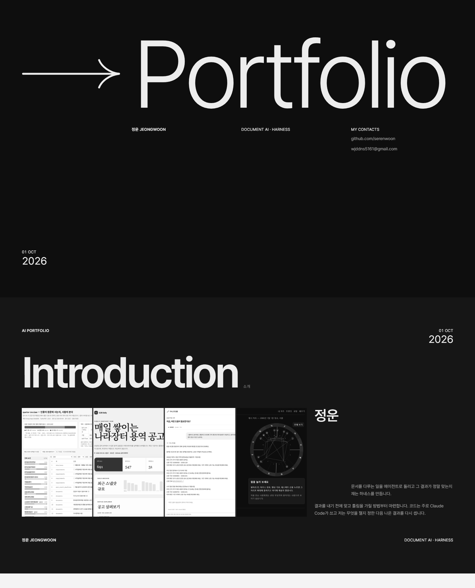

# portfolio

정운의 포트폴리오 페이지입니다. 문서를 다루는 일을 에이전트로 돌리고, 그 결과가 정말 맞는지 재는 하네스를 만듭니다.

화면은 https://serenwoon.github.io/portfolio/ 에서 볼 수 있습니다.

## 무엇이 들어 있나

표지, 소개, 대표작, 검증 하네스, 배포와 도구, 대회, Solar for Bid 세 장(제품, 화면 시안, 파이프라인), 미리창구 세 장(제품, 대시보드, 데이터), 학력, 연락처까지 열네 장을 한 페이지에 이어 붙였습니다. 한 장이 한 화면이고, 표지를 뺀 모든 장이 같은 머리와 꼬리를 답니다.

카드에 적은 숫자는 각 저장소 README에서 그대로 옮겼습니다. 그림 다섯 장(ledger-reconcile 누적 막대, wikilink-audit 정밀도, youtube-sentiment-pipeline 구간, agent-workflow 판정 루프, edit-receipt 영수증)은 사진이 아니라 그 숫자로 다시 그린 것입니다.

Solar for Bid는 발표 자료 25장 가운데 네 장(8 · 12 · 14 · 15쪽)을 흑백으로 실었습니다. 슬라이드와 화면 디자인은 팀 디자이너가 했습니다. 화면은 디자인 시안이고, 그 안의 가상 회사 이름과 데모 공고 한 건의 이름·번호, 요구사항 ID, 일부 서류 이름 같은 글자는 회색 막대로 가리거나 지웠습니다. 16쪽의 파이프라인은 같은 내용을 우리말로 줄여 옮겨 그렸습니다.

미리창구는 팀 동의를 받아 배포판 화면(연습 화면 넷, 대시보드, AI 제안 카드)을 실었습니다. 2026-10-01에 체험 경로로 들어가 캡처했고, 화면 설계와 구현은 다른 팀원들(디자인·풀스택·실시간 LLM 담당)이 했습니다. 화면에 나오는 숫자는 전부 고정 시드로 만든 합성 데이터이고, 실제 사용 기록이 아닙니다.

화면 캡처는 공개 저장소에 있던 스크린샷과 배포된 사이트를 흑백으로 바꿔 실었습니다. 「다시, 한 걸음」 두 장은 가상 입력(만 26세 · 주거)을 넣어 2026-09-30에 받은 응답이고, 맞춤 비교가 끝나지 않아 검색된 후보를 먼저 보여 준 상태 그대로입니다.

## 디자인

색은 회색 단계만 씁니다. 모든 색 값이 R = G = B이고, 위계는 글자 크기와 굵기, 명도, 여백으로만 만들었습니다. 둥근 모서리와 그림자, 그라디언트는 없습니다.

가장 큰 글자(표지 제목)와 가장 작은 글자(라벨)는 스무 배 넘게 차이 납니다. 그 낙차를 지키려고 중간 크기 글자는 거의 두지 않았습니다.

그리드는 화면 폭에 따라 12칸, 8칸, 4칸으로 바뀝니다. 서체는 Pretendard이고 jsDelivr에서 불러옵니다.

## 만든 순서

Claude Design 캔버스에 데스크톱과 모바일 아트보드를 펼쳐 초안을 잡고, 확정한 뒤 이 페이지 한 장으로 옮겼습니다. 코드는 Claude Code가 썼습니다.

문구는 윤문을 두 번 거쳤습니다. 그때 숫자 문장이 두 번 틀어졌습니다. 「나눠 쟀다」가 「나눠 비교했다」로, 「0.980으로 정정했다」가 「지금은 0.980」으로 바뀐 것인데, 둘 다 저장소 원문과 대조해서 되돌렸습니다.

## 돌리는 데 필요한 것

빌드가 없습니다. `index.html` 하나와 `assets/` 폴더가 전부라서 파일을 브라우저로 열면 됩니다. 인터넷에서 받아 오는 것은 서체 하나뿐이고, 연결이 없으면 시스템 고딕으로 대신 그립니다.

등장 애니메이션은 운영체제에서 동작 줄이기를 켜 두면 나오지 않습니다.

## 지금 상태

소개 장의 큰 이미지 자리는 원래 본인 사진을 넣으려던 곳입니다. 지금은 라이브 화면 네 장을 모아 채워 두었습니다.

## 라이선스

라이선스 파일을 두지 않았습니다. 글과 이미지의 권리는 저자에게 있습니다.
